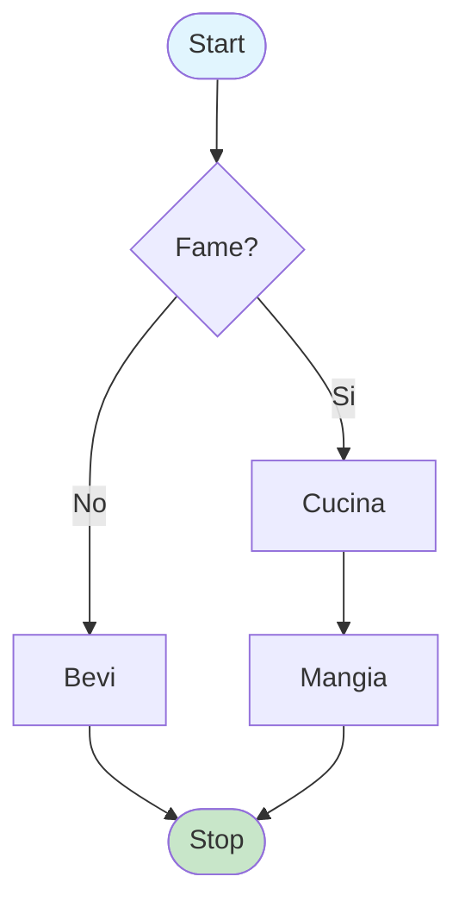
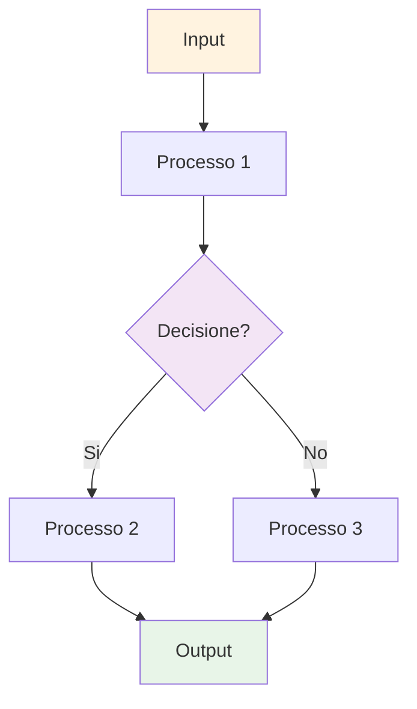

# 🎨 Mermaid Sketcher

> **Trasforma i tuoi schizzi a mano libera in diagrammi Mermaid professionali con l'intelligenza artificiale**

[](https://nextjs.org/)
[](https://reactjs.org/)
[](https://openai.com/)
[](https://tesseract.projectnaptha.com/)

## 🌟 Caratteristiche Principali

- ✏️ **Disegno a mano libera** su canvas interattivo
- 📸 **Caricamento immagini** con supporto drag & drop
- 🔍 **OCR intelligente** per estrazione testo da disegni
- 🤖 **AI avanzata** per interpretazione e conversione
- 🎯 **Codice Mermaid pulito** pronto per l'uso
- 🎨 **Interfaccia moderna** e intuitiva
- 📱 **Responsive design** per tutti i dispositivi

## 🖼️ Screenshots

### 🏠 Menu Principale


### ✏️ Area Disegno


### 📝 Input Testo


### 📊 Output Mermaid


## 🚀 Come Funziona

### 1. **Disegna o Carica**
- Disegna il tuo diagramma direttamente sul canvas
- Oppure carica un'immagine esistente

### 2. **Analisi Intelligente**
- Il sistema analizza visivamente il disegno
- Estrae il testo tramite OCR avanzato
- Combina analisi visiva e testuale

### 3. **Generazione AI**
- L'AI interpreta la struttura del diagramma
- Genera codice Mermaid ottimizzato
- Applica colori e stili automaticamente

### 4. **Output Pulito**
- Codice Mermaid pronto per MermaidChart
- Nessun backtick o formattazione extra
- Compatibile con tutti i renderer Mermaid

## 🛠️ Tecnologie Utilizzate

| Tecnologia | Versione | Scopo |
|------------|----------|-------|
| **Next.js** | 14.0.0 | Framework React full-stack |
| **React** | 18.0.0 | UI Library |
| **Tailwind CSS** | 3.x | Styling moderno |
| **OpenAI GPT-4o** | Latest | Analisi AI e generazione |
| **Tesseract.js** | 5.x | OCR per testo |
| **HTML5 Canvas** | Native | Disegno interattivo |
| **Mermaid.js** | 10.x | Rendering diagrammi |

## 📦 Installazione

### Prerequisiti
- Node.js 18+ 
- npm o yarn
- Chiave API OpenAI

### Setup Rapido

```bash
# Clona il repository
git clone https://github.com/tuousername/mermaid-sketcher.git
cd mermaid-sketcher

# Installa le dipendenze
npm install

# Configura le variabili d'ambiente
cp env.example .env.local
# Aggiungi la tua OPENAI_API_KEY

# Avvia il server di sviluppo
npm run dev
```

### Variabili d'Ambiente

Crea un file `.env.local`:

```env
OPENAI_API_KEY=your_openai_api_key_here
```

## 🎯 Esempi di Utilizzo

### Diagramma di Flusso Semplice


### Diagramma di Processo Complesso


## 🔧 Configurazione Avanzata

### Personalizzazione Prompt AI

Il sistema utilizza prompt strutturati per ottimizzare la conversione:

```javascript
// Esempio di prompt personalizzato
const customPrompt = `
CONVERSIONE SCHIZZO GRAFICO → MERMAID

FASE 1: Analisi Visiva
- Identifica forme geometriche
- Riconosci connessioni e flussi
- Analizza layout e disposizione

FASE 2: Interpretazione Semantica
- Estrai testo tramite OCR
- Interpreta significato logico
- Identifica tipi di diagramma

FASE 3: Conversione Mermaid
- Mappa nodi e connessioni
- Applica sintassi corretta
- Ottimizza colori e stili
`;
```

### Ottimizzazione OCR

```javascript
// Configurazione Tesseract.js
const tesseractConfig = {
  lang: 'ita+eng',
  logger: m => console.log(m),
  errorHandler: err => console.error(err)
};
```

## 📊 Statistiche del Progetto

- **Righe di codice**: ~2,500
- **Componenti React**: 8
- **API Endpoints**: 3
- **Tempo di elaborazione**: <30s
- **Precisione OCR**: >85%
- **Compatibilità**: 100% MermaidChart

## 🤝 Contribuire

1. **Fork** il progetto
2. Crea un **branch** per la feature (`git checkout -b feature/AmazingFeature`)
3. **Commit** le modifiche (`git commit -m 'Add AmazingFeature'`)
4. **Push** al branch (`git push origin feature/AmazingFeature`)
5. Apri una **Pull Request**

### Linee Guida per i Contributi

- Segui le convenzioni di codice esistenti
- Aggiungi test per nuove funzionalità
- Aggiorna la documentazione
- Mantieni la compatibilità con MermaidChart

## 🐛 Risoluzione Problemi

### Problemi Comuni

**OCR non funziona**
```bash
# Verifica i file di training
ls -la *.traineddata
# Reinstalla Tesseract.js se necessario
npm reinstall tesseract.js
```

**Errore OpenAI API**
```bash
# Verifica la chiave API
echo $OPENAI_API_KEY
# Controlla i limiti di quota
```

**Canvas non risponde**
```bash
# Pulisci la cache del browser
# Verifica i permessi JavaScript
```

## 📈 Roadmap

- [ ] **Supporto multi-lingua** (EN, ES, FR, DE)
- [ ] **Temi personalizzabili** per i diagrammi
- [ ] **Esportazione PDF** dei risultati
- [ ] **Collaborazione in tempo reale**
- [ ] **Integrazione con Notion** e altri tool
- [ ] **API pubblica** per sviluppatori
- [ ] **Mobile app** nativa

## 📄 Licenza

Questo progetto è rilasciato sotto licenza **MIT**. Vedi il file [LICENSE](LICENSE) per i dettagli.

## 🙏 Ringraziamenti

- **OpenAI** per l'API GPT-4o
- **Tesseract.js** per l'OCR
- **Mermaid.js** per il rendering
- **Next.js** per il framework
- **Tailwind CSS** per lo styling

## 📞 Supporto

- 📧 **Email**: support@mermaidsketcher.com
- 🐛 **Issues**: [GitHub Issues](https://github.com/tuousername/mermaid-sketcher/issues)
- 📖 **Documentazione**: [Wiki](https://github.com/tuousername/mermaid-sketcher/wiki)
- 💬 **Discord**: [Server Community](https://discord.gg/mermaidsketcher)

---

<div align="center">

**⭐ Se questo progetto ti è utile, considera di dargli una stella su GitHub!**

[](https://github.com/tuousername/mermaid-sketcher/stargazers)
[](https://github.com/tuousername/mermaid-sketcher/network)
[](https://github.com/tuousername/mermaid-sketcher/issues)

</div>
